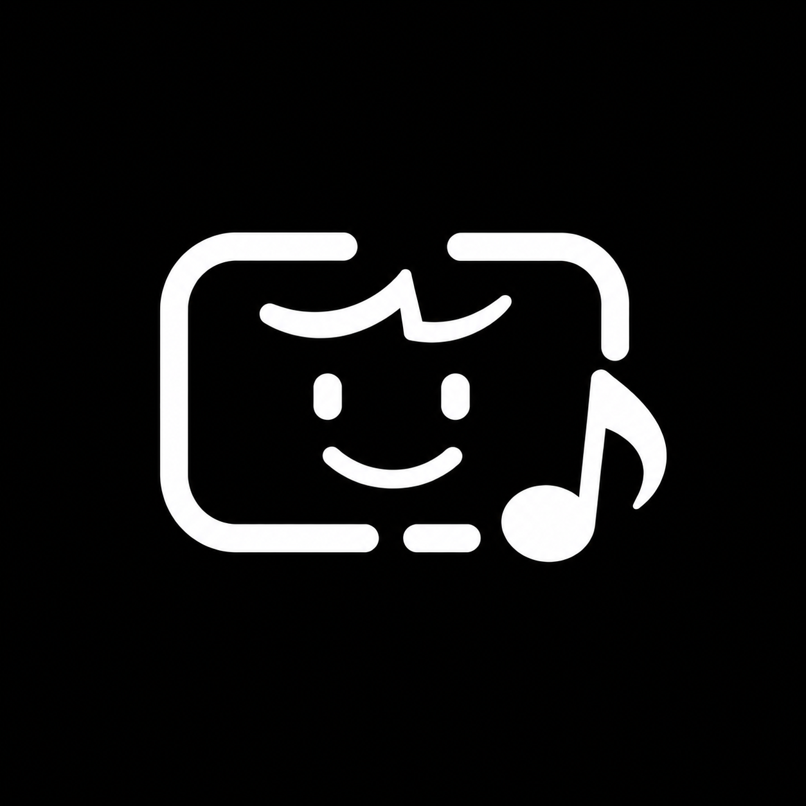

<!-- readme-revision: 1 -->
<!-- source-version: 1.0.1 -->
<!-- source-build: 1 -->

<p align="center">
  
</p>

# Lyrinotch

[English](README.md) | [繁體中文](README.zh-Hant.md) | [简体中文](README.zh-Hans.md) | [日本語](README.ja.md)

<!-- section: overview -->

An unofficial, third-party macOS menu-bar app that keeps synchronized lyrics close to the MacBook notch—or in a floating card on any other display—for Spotify and Apple Music.

> **Lyrinotch is not affiliated with, authorized by, sponsored by, or endorsed by Spotify, Apple, Apple Music, LRCLIB, or any other lyric provider.**

| | |
|---|---|
| **Current source version** | 1.0.1 (build 1) |
| **Platform** | macOS 14+; Apple Silicon recommended |
| **Players** | Spotify desktop app and/or Music.app |
| **Interface languages** | English, Traditional Chinese, Simplified Chinese, Japanese, and Follow System |
| **License** | [MIT](LICENSE) |
| **Repository** | [github.com/barrygg11/lyrinotch](https://github.com/barrygg11/lyrinotch) |

The source-tree version can be newer than the latest downloadable GitHub artifact. Check each item on the [Releases page](https://github.com/barrygg11/lyrinotch/releases) for its version, signing, and notarization status.

### Disclaimer

- Spotify, Apple Music, lyrics, and album artwork remain the property of their respective owners.
- Lyrinotch displays lyrics for personal, on-screen use while you play music you are allowed to access. Do not use it to copy, redistribute, commercially exploit lyrics, or bypass paid access or DRM.
- Online and local lyric sources are independent of Lyrinotch. Availability, song matching, timestamps, and accuracy are not guaranteed.
- The software is provided **“AS IS”**, without warranty, under the [MIT License](LICENSE).
- Product and service names are used only to identify compatibility. Lyrinotch uses original artwork rather than Spotify or Apple logos.

The in-app version is available from **About Lyrinotch → Disclaimer**.

<!-- section: features -->

## Highlights

### A lyric surface for every display

- **Notched MacBooks:** the collapsed island shows the current lyric below the camera housing; hover or expand it for more lines and controls.
- **Other displays:** a floating card appears below the menu bar.
- Follow the mouse, use the main display, or pin the overlay to a specific screen.
- Optionally hide in full screen, allow click-through behavior, adjust layout, and choose the expanded presentation mode.

### Playback that stays out of the way

- Reads title, artist, album, duration, position, artwork, and playback state through local AppleScript Automation.
- Supports Automatic, Prefer Spotify, and Prefer Apple Music selection, with fallback when the preferred player is not playing.
- Provides previous, play/pause, next, seek/progress, and quick lyric-timing controls from the expanded overlay.
- Includes configurable global hotkeys and launch at login for packaged apps.

### Appearance and accessibility

- Adjust lyric size, surface opacity, artwork-derived color, spacing, vertical position, and display behavior with live previews.
- Configure Liquid Glass independently for the notch island and floating card where the running macOS version supports it.
- Uses the chosen interface language across Settings and presentation text.
- Keeps paused controls available so playback can be resumed from the overlay.

<!-- section: lyrics -->

## Lyrics, translation, and timing

### Lyric sources

| Source | Network? | Notes |
|--------|----------|-------|
| LRCLIB | Yes | Default provider preference for new installs. |
| NetEase / lyrics.ovh | Yes | Used only when the selected provider preference enables them. |
| Music.app embedded lyrics | Local | Queried when the configured pipeline allows the local Music source. |
| Local `.lrc` import | Local | Explicit file selection; UTF-8 and BOM-marked UTF-16; maximum 1 MB. |
| Tap Sync | Local | Record lyric-line anchors while the track plays and resume the project later. |

Provider preferences control both automatic lookup and manual search. Lyrinotch does not scrape Spotify Web or Apple Music Web, and it does not bundle copyrighted `.lrc` files in this repository.

### Recovery when synchronized lyrics are missing

- Plain lyrics, too few timed lines, and a sparse playback window are reported as different states rather than one generic calibration failure.
- Import an existing LRC when you trust its version.
- Use **Tap Sync** to mark lines during one playback. Exact taps remain exact; gaps, intros, and outros are estimated from neighboring anchors and the original cadence.
- Tap Sync drafts, undo history, source fingerprints, and generated timelines can survive restart without retaining the imported file path.

### Translation

Optional translation supports Traditional Chinese, Simplified Chinese, English, and Japanese through MyMemory. MyMemory infers the source language, while the user chooses the target language. The current and next lyric lines may be sent with the inferred source language and user-selected target language so the next line can be ready in time.

### Timing correction

- Set a global lyric offset for the current setup.
- Adjust the current track in ±0.5-second steps, align the next line immediately, or clear that track’s correction.
- Optional microphone calibration is **off by default** and intended for speaker playback. It compares lyric timestamps with a locally reduced onset/energy envelope.
- Calibration requires usable synchronized lyric points and stable playback. Ambiguous, boundary, interrupted, route-changed, or stale samples are rejected rather than saved.
- Corrections are isolated by player, track identity, lyric timeline, and audio environment.

<!-- section: permissions -->

## Permissions and troubleshooting

### Automation

Lyrinotch needs Automation access for each player it reads or controls.

1. Open Apple Music and/or Spotify first.
2. Open **Lyrinotch Settings → Players**.
3. Select **Check Permission** for one player, or **Check All Permissions** to verify them sequentially.
4. Respond to the macOS consent prompt if one appears.

The app distinguishes **Authorized**, **Not authorized**, **Denied**, **Player not open**, **Verification timed out**, and **Not verified**. “Player not open” is not a denied permission—launch that player and check again. If access was denied, enable Lyrinotch under **System Settings → Privacy & Security → Automation** and recheck it in the app.

Changing the app’s signature or running a differently packaged copy can cause macOS to treat it as a different Automation client. Prefer one installed, consistently signed app during regular use.

### Microphone

Microphone permission is requested only after you enable automatic lyric calibration or start a manual recalibration that can use speaker feedback. You can leave it disabled and use LRC import, Tap Sync, or manual offsets instead.

<!-- section: privacy -->

## Privacy and data flow

Lyrinotch can use fully local lyric sources, but online provider lookup, translation, remote artwork, and update checking require network access.

| Activity | Local / network | What may leave your Mac |
|----------|-----------------|-------------------------|
| Read now-playing; play, pause, skip, or seek | Local Automation | Nothing; Apple events go only to player apps on this Mac. |
| Fetch or search lyrics | Network for enabled providers; optional local Music.app query | Title, artist, duration, album, and related query metadata needed to identify the track. |
| Translate lyrics | Network, optional MyMemory feature | Current and next lyric lines, the inferred source language, and the user-selected target language. |
| Load album artwork | Local and/or network | A remote image request when the player supplies an HTTPS artwork URL. |
| Calibrate timing with a microphone | Local, optional | No microphone audio is uploaded. A 10–18 second pass is reduced in memory to an onset/energy envelope; raw samples are not written to disk. |
| Import LRC or use Tap Sync | Local | Nothing. Parsed timelines, anchors, undo history, track identity, and lyric fingerprints may be stored locally. The original file path is not retained. |
| Check for updates | Network, GitHub | App version and standard HTTP request metadata. |
| Spotify / Apple account login | Not used | Lyrinotch stores no Spotify or Apple OAuth tokens. |
| Analytics, ads, or first-party telemetry | None | Lyrinotch operates no user-tracking backend. |

Locally persisted data can include preferences, selected lyrics, provider caches, artwork caches, translation cache, per-track offsets, calibration confidence/environment fingerprints, and Tap Sync projects. **Clear Selected Lyrics and Track Corrections…** removes manually selected lyrics, per-track timing corrections, Tap Sync drafts and undo history, and memory caches; other preferences are unchanged.

For the security-reporting policy and the detailed local-processing commitments, see [SECURITY.md](SECURITY.md).

<!-- section: install -->

## Install a packaged build

When a suitable artifact is available on [GitHub Releases](https://github.com/barrygg11/lyrinotch/releases):

1. Read its release notes and signing/notarization status.
2. Open the DMG.
3. Drag **Lyrinotch.app** to **Applications**, replacing an older copy if needed.
4. Launch the installed app. An unnotarized local build may require **right-click → Open** on first launch.
5. Open the players you use and verify Automation permission in **Settings → Players**.

Launch at login works reliably from a packaged `.app`; it is not intended for `swift run` sessions.

### Requirements

- macOS 14+
- Spotify and/or Music (Apple Music) desktop app
- Automation permission for each player you use
- Optional microphone permission for speaker-based timing calibration
- Xcode 16+ or a Swift 5.10+ toolchain when building from source

<!-- section: build -->

## Build and run from source

```bash
git clone https://github.com/barrygg11/lyrinotch.git
cd lyrinotch

swift build
swift test

# Menu bar app + overlay; keep the terminal session open.
swift run Lyrinotch

# CLI diagnostics / polling modes.
swift run Lyrinotch --cli
swift run Lyrinotch --once
swift run Lyrinotch --cli --interval-ms 1000
swift run Lyrinotch --help
```

Create a local double-clickable app or disk image:

```bash
./scripts/package-app.sh
open dist/Lyrinotch.app

./scripts/create-dmg.sh --local
```

Generated apps, DMGs, checksums, and Swift build products remain outside Git through `.gitignore`.

<!-- section: signing -->

## Signing and distribution modes

| Mode | Intended use | Important behavior |
|------|--------------|--------------------|
| Ad-hoc, default | Local source builds | Not notarized; manual update installation; macOS may ask for permissions again when identity changes. |
| Apple Development | Stable testing on authorized development Macs | Identified local build, but not a public distribution or notarized release. |
| Developer ID Application | Public distribution | Must follow the clean tag, hardened runtime, timestamp, notarization, stapling, integrity, and checksum process. |

Example local Apple Development build—use values from your own Keychain and developer account:

```bash
security find-identity -v -p codesigning

export SIGN_IDENTITY="Apple Development: Your Name (CERTIFICATE_ID)"
export UPDATE_TEAM_ID="YOURTEAMID"
export DMG_SIGN_IDENTITY="$SIGN_IDENTITY"
./scripts/create-dmg.sh --local
```

Do not publish the resulting local DMG as an official release. Maintainers preparing a Developer ID artifact must follow [docs/releasing.md](docs/releasing.md), which covers version/tag checks, code signing, notarization, stapling, mounted-DMG validation, SHA-256 generation, and release verification.

The in-app updater offers automatic replacement only when the running app embeds a trusted Team ID. Before replacing anything, it validates the repository release URL, optional GitHub SHA-256 digest, bundle identifier, version, code signature, and Team ID, then stages the replacement with rollback support.

<!-- section: layout -->

## Project layout and configuration

```text
lyrinotch/
├── README.md                    # English canonical documentation
├── README.zh-Hant.md            # Traditional Chinese
├── README.zh-Hans.md            # Simplified Chinese
├── README.ja.md                 # Japanese
├── Package.swift
├── Resources/                   # Info.plist, entitlements, localized permission text, icons
├── scripts/
│   ├── package-app.sh           # Build dist/Lyrinotch.app
│   ├── create-dmg.sh            # Build and validate a versioned DMG
│   ├── check-readme-sync.sh     # Validate multilingual README parity
│   ├── test-release-notes-checker.sh # Test the release-note validator
│   ├── check-release-notes.sh   # Validate release notes against Info.plist
│   └── check-coverage.sh        # Enforce the CI coverage floor
├── Sources/
│   ├── Lyrinotch/               # App shell, Settings, overlay controller, CLI
│   └── LyrinotchCore/           # Models, services, localization, shared UI
├── Tests/LyrinotchTests/
└── docs/                        # Release notes, roadmap, and release process
```

Public project, support, and update metadata is configured in `Sources/Lyrinotch/App/AppInfo.swift`:

| Field | Purpose |
|-------|---------|
| `repositoryURL` | Issues and update release origin |
| `koFiURL` and other support URLs | Support-window destinations |
| `supportEmail` | Security/support mail fallback |

<!-- section: verification -->

## Verification

CI verifies multilingual documentation and release notes, strict Swift concurrency, an optimized Release build, tests with code coverage, and a 25% production-source line coverage floor.

```bash
bash scripts/check-readme-sync.sh
bash scripts/test-release-notes-checker.sh
bash scripts/check-release-notes.sh

swift test --enable-code-coverage \
  -Xswiftc -strict-concurrency=complete \
  -Xswiftc -warn-concurrency \
  -Xswiftc -warnings-as-errors

bash scripts/check-coverage.sh 25
swift build -c release
```

The README checker requires identical revision/version markers and section order across all four languages, and rejects missing local Markdown link targets.

<!-- section: contributing -->

## Contributing and support

Focused pull requests are welcome. Read [CONTRIBUTING.md](CONTRIBUTING.md), keep provider/privacy behavior explicit, update all four READMEs when public behavior changes, and run the verification commands above.

- General bugs and feature requests: [GitHub Issues](https://github.com/barrygg11/lyrinotch/issues)
- In-app diagnostics: **About → Report a problem…**
- Security-sensitive reports: [SECURITY.md](SECURITY.md)
- Project support: [Ko-fi](https://ko-fi.com/barrylai)

Quick repository commitments:

- Original app and menu-bar artwork; no Spotify or Apple official logos.
- No copyrighted lyric database or lyric files committed to the repository.
- No first-party analytics, ad SDK, or tracking backend.
- Automation and microphone permissions are explained and optional features remain optional.

<!-- section: license -->

## License

[MIT](LICENSE) — Copyright © 2026 barry.

Third-party names, trademarks, lyrics, music, and artwork remain the property of their respective owners and are used only to identify compatibility or display user-requested media.
